# Obsidian Links <!-- omit in toc -->

Manipulate links in [Obsidian](https://obsidian.md).

- [Features](#features)
  - [Unlink](#unlink)
  - [Delete link](#delete-link)
  - [Convert wikilink or html link to markdown link](#convert-wikilink-or-html-link-to-markdown-link)
  - [Convert markdown link to Wikilink](#convert-markdown-link-to-wikilink)
  - [Convert markdown link to autolink](#convert-markdown-link-to-autolink)
  - [Convert autolink to markdown link](#convert-autolink-to-markdown-link)
  - [Convert URL to markdown link](#convert-url-to-markdown-link)
  - [Convert URL to autolink](#convert-url-to-autolink)
  - [Convert multiple links](#convert-multiple-links)
    - [Convert all links to markdown links](#convert-all-links-to-markdown-links)
    - [Convert wikilinks to markdown links](#convert-wikilinks-to-markdown-links)
    - [Convert autolinks to markdown links](#convert-autolinks-to-markdown-links)
    - [Convert URLs to markdown links](#convert-urls-to-markdown-links)
    - [Convert HTML links to markdown links](#convert-html-links-to-markdown-links)
  - [Copy link destination to clipboard](#copy-link-destination-to-clipboard)
  - [Remove links from headings](#remove-links-from-headings)
    - [Configuration](#configuration)
      - [Internal wikilink without text](#internal-wikilink-without-text)
  - [Edit link text](#edit-link-text)
  - [Edit link destination](#edit-link-destination)
  - [Set link text](#set-link-text)
  - [Set link text from clipboard](#set-link-text-from-clipboard)
  - [Create link from selection](#create-link-from-selection)
  - [Create link from clipboard](#create-link-from-clipboard)
  - [Embed / Unembed files](#embed--unembed-files)
  - [Copy link](#copy-link)
  - [Cut link](#cut-link)

# Features

## Unlink

Unlink single link or all links in a selection.

- Command palette: **Unlink**
- Context menu: **Unlink**

Demo. Single link.

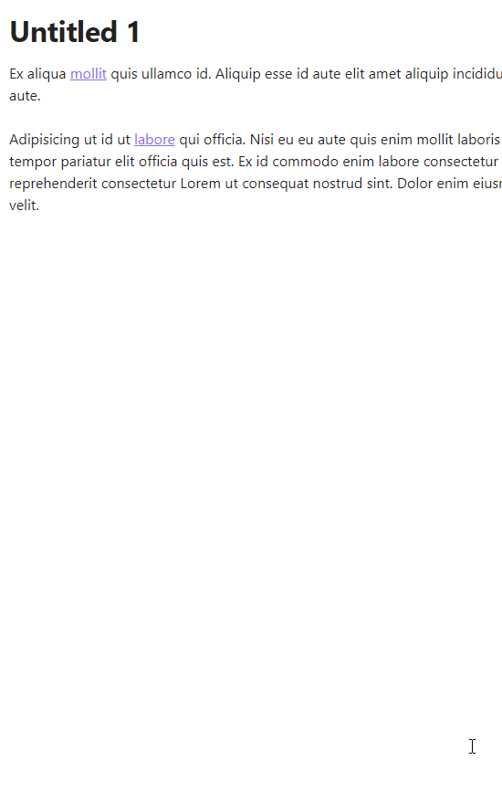

Demo. Links in a selection.

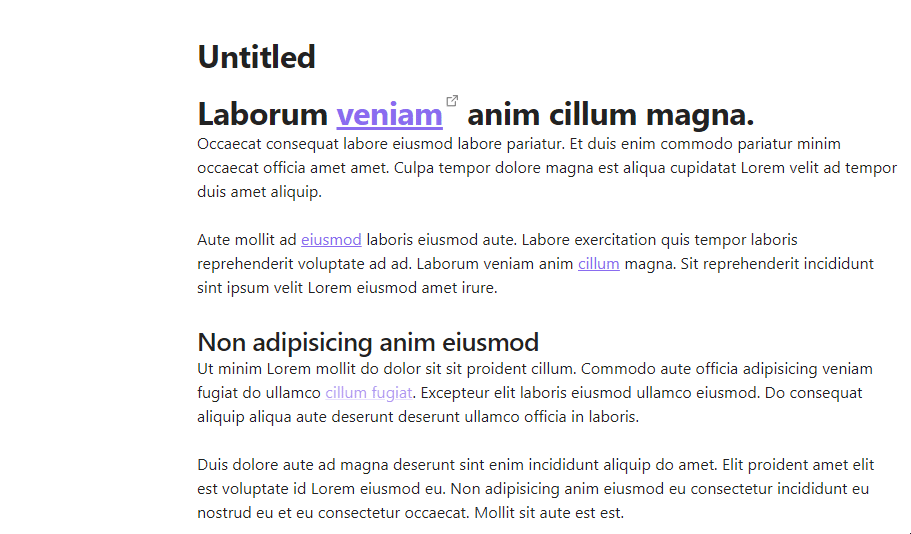

## Delete link

- Command palette: **Delete link**
- Context menu: **Delete**

If the target file for the deleted link is unreferenced the prompt to delete the file is displayed.
Configure this feature in the plugin settings:

Demo. Wikilink

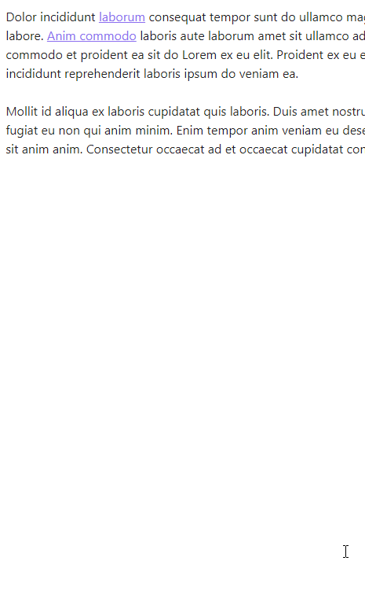

Demo. Makdown link

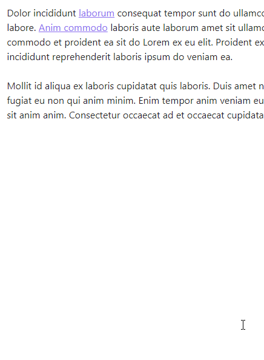

Demo. Autolink

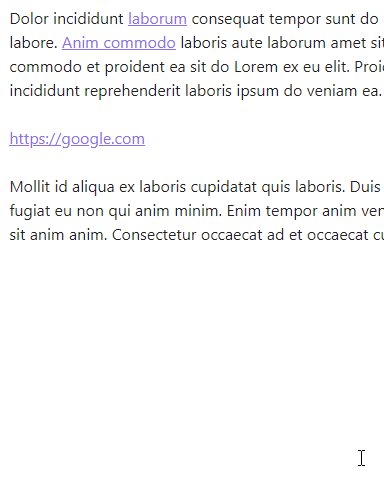

## Convert wikilink or html link to markdown link

Convert a wikilink or HTML link to a markdown link. If a wiki link contains spaces a destination of a markdown link will be places in `<>`. HTML link must be expanded.

If a wikilink destination doesn't have an extension, the `.md` extension can be added to a markdown link destination after conversion by enabling the **Convert to Markdown link | Append extension** option in Settings.

- Command palette: **Convert to markdown link**
- Context menu: **Convert to markdown link**

Demo. Wikilink

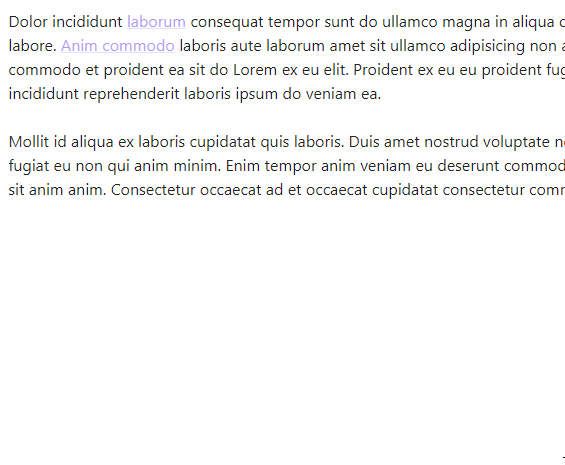

Demo. HTML link

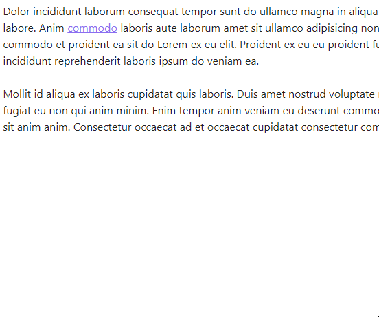

see [Convert wikilinks to markdown links](#convert-wikilinks-to-markdown-links) 
see [Convert HTML links to markdown links](#convert-html-links-to-markdown-links)

## Convert markdown link to Wikilink
- Command palette: **Convert to wikilink**
- Context menu: **Convert to wikilink**

Demo

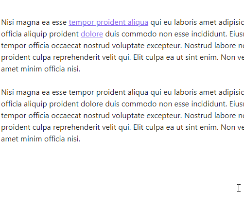

## Convert markdown link to autolink

Converts a markdown link with an absolute URL or an email address to an autolink.

- Command palette: **Convert to autolink**
- Context menu: **Convert to autolink**

Demo. Markdown link with absolute URL.

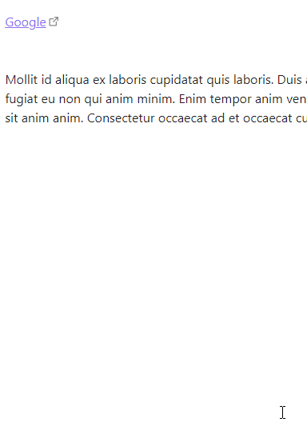

Demo. Markdown link with email address.

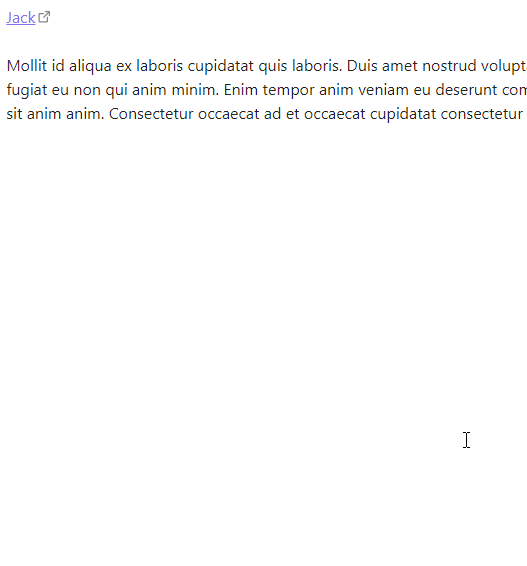

## Convert autolink to markdown link

Convert an autolink to a markdown link.
If an autolink has an absolute URI with `http` or `https` scheme content of the `<title/>` element will be set as a link text. If request fails or the URL has other scheme cursor will be placed inside the `[]` of the markdown link. For email autolink `mailto` scheme will be added before email address.

- Command palette: **Convert to markdown link**
- Context menu: **Convert to markdown link**

Demo. Convert autolink to markdown link

see [Convert autolinks to markdown links](#convert-autolinks-to-markdown-links)

## Convert URL to markdown link

Convert a raw URL to a markdown link.
If a URL has an absolute URI with `http` or `https` scheme content of the `<title/>` element will be set as a link text. If request fails or the URL has other scheme cursor will be placed inside the `[]` of the markdown link.

- Command palette: **Convert to markdown link**
- Context menu: **Convert to markdown link**

Demo. Convert a URL to a markdown link

see [Convert URLs to markdown links](#convert-urls-to-markdown-links)

## Convert URL to autolink

Convert an absolute URL to an autolink.

- Command palette: **Convert to autolink**
- Context menu: **Convert to autolink**

Demo. Convert an absolute URL to an autolink

## Convert multiple links

Converts multiple links in a note or in a selection to markdown links.

### Convert all links to markdown links
Convert plain URLs, html links, wiki links, autolinks in a note or in a selection to markdown links.
For URLs and autolinks with absolute URL with `http://` or `https://` schemes link text will be set to a content of a `<title/>` element of the page loaded from the URL.

If a wikilink destination doesn't have an extension, the `.md` extension can be added to a markdown link destination after conversion by enabling the **Convert to Markdown link | Append extension** option in Settings.

- Command palette: **Convert all links to Markdown links**
- Context menu: **Convert all links to Markdown links** (enable in Settings)

Demo. Convert all links in a note to markdown links 

Demo. Convert all links in a selection to markdown links 

### Convert wikilinks to markdown links
Convert multiple wikilinks in a note or in a selection to markdown links.

If a wikilink destination doesn't have an extension, the `.md` extension can be added to a markdown link destination after conversion by enabling the **Convert to Markdown link | Append extension** option in Settings.

- Command palette: **Convert Wikilinks to Markdown links**
- Context menu: **Convert Wikilinks to Markdown links** (enable in Settings)

Demo. see [Convert all links to markdown links](#convert-all-links-to-markdown-links)

see [Convert all links to markdown links](#convert-all-links-to-markdown-links)

### Convert autolinks to markdown links
Convert multiple autolinks in a note or in a selection to markdown links.
For autolinks with absolute URL with `http://` or `https://` schemes link text will be set to a content of a `<title/>` element of the page loaded from the URL.

- Command palette: **Convert Autolinks to Markdown links**
- Context menu: **Convert Autolinks to Markdown links** (enable in Settings)

Demo. see [Convert all links to markdown links](#convert-all-links-to-markdown-links)

### Convert URLs to markdown links
Convert multiple raw URLs in a note or in a selection to markdown links.
For absolute URLs with `http://` or `https://` schemes link text will be set to a content of a `<title/>` element of the page loaded from the URL.

- Command palette: **Convert URLs to Markdown links**
- Context menu: **Convert URLs to Markdown links** (enable in Settings)

Demo. see [Convert all links to markdown links](#convert-all-links-to-markdown-links)

### Convert HTML links to markdown links
Convert multiple raw URLs in a note or in a selection to markdown links.

- Command palette: **Convert HTML links to Markdown links**
- Context menu: **Convert HTML links to Markdown links** (enable in Settings)

Demo. see [Convert all links to markdown links](#convert-all-links-to-markdown-links)

## Copy link destination to clipboard

Copy link part of markdown, wiki or html link to the clipboard.

- Command palette: **Copy link destination**
- Context menu: **Copy link destination**

Demo

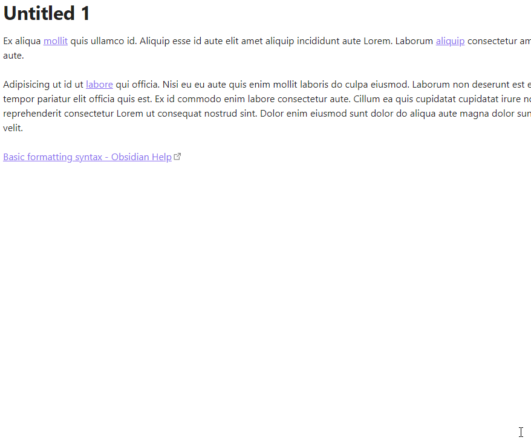

## Remove links from headings

Remove links from headings in selection or in an entier note. 
Each link is replaced with it's text. Links without text are removed. Wikilink without text by default replaced with it's destination.

- Command palette:  **Remove links from headings**

Demo

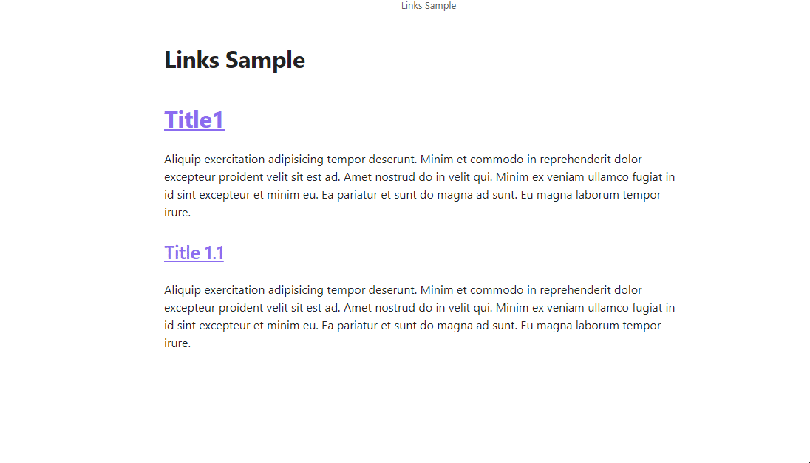

### Configuration

#### Internal wikilink without text

Available options:
- Remove
- Replace with destination   [default]
- Replace with lowest heading

Demo. Remove

Original text:

After command execution:

Demo. Replace with destination

Original text:

After command execution:

Demo. Replace with lowest heading

Original text:

After command execution:

## Edit link text

Select link text and place cursor at the end of the text

- Command palette: **Edit link text**
- Context menu: **Edit link text**

Demo

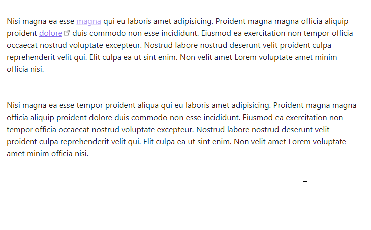

## Edit link destination

Select link text and place cursor at the end of the text

- Command palette: **Edit link destination**
- Context menu: **Edit link destination**

Demo

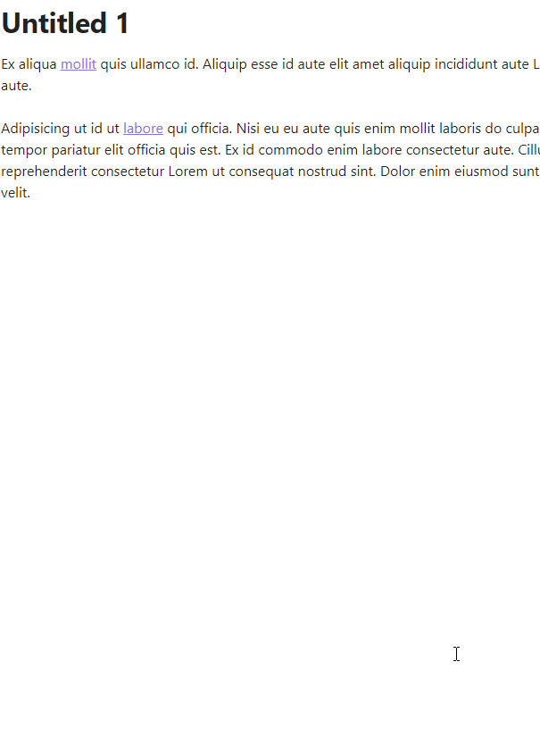

## Set link text
Change or add link text, select it and place cursor at the end of the text. 
Link text depends on the kind of a link. 
For local notes text will be either file name of the note or popup with suggested link texts. Title separator can be specified in the plugin settings. 
For external http[s] links, page content is requested and link text is set to the title (content of `<title/>` element) of the requested page content.

- Command palette: **Set link text**
- Context menu: **Set link text**

Demo. Link to a local note

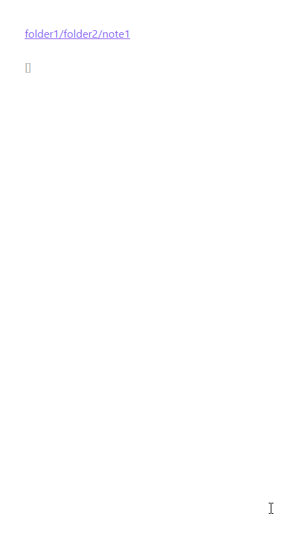

Demo. Link to a heading in a local note

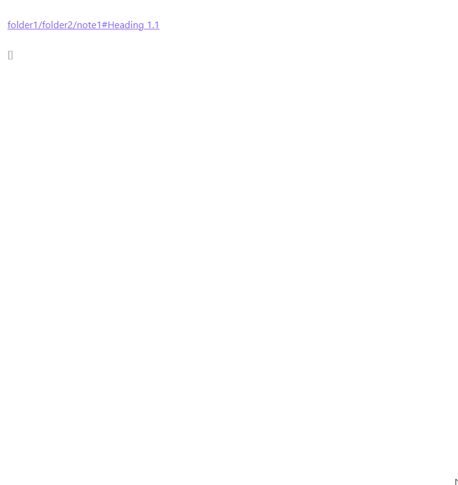

Demo. External link

## Set link text from clipboard

Set markdown, wikilink or URL text from clipboard.
Links that can't have text, like URL, will be converted to markdown link.

- Command palette: **Set link text from clipboard**
- Context menu: **Set link text from clipboard**

Demo.

Demo. Link to image

## Create link from selection
Create link from selected text.

- Command palette: **Create link**
- Context menu: **Create link**

Demo

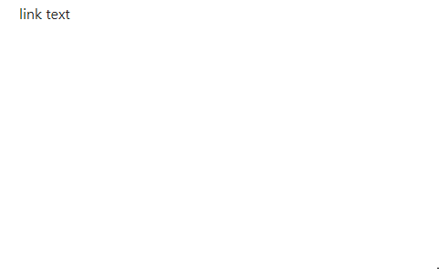

## Create link from clipboard
Create link from textual content of the system clipboard.

- Command palette: **Create link from clipboard**
- Context menu: **Create link from clipboard**

Demo

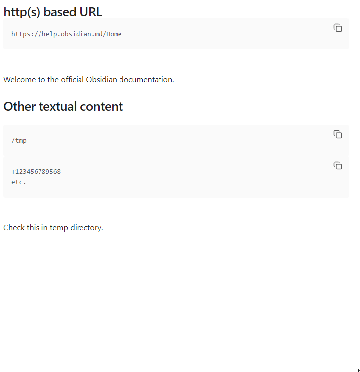

## Embed / Unembed files

Add or remove [file embedding](https://help.obsidian.md/Linking+notes+and+files/Embedding+files#:~:text=To%20embed%20a%20file%20in,of%20the%20Accepted%20file%20formats.) from a wikilink or a markdown link.

- Command palette: Embed / Unembed link
- Context menu: Embed / Unembed

Demo. Embed 

Demo. Unembed 

## Copy link

Copy markdown, wiki, auto, html link or plain url to the clipboard

- Command palette: Copy link
- Context menu: Copy link

Demo. Copy link to the clipbard 

## Cut link

Cut markdown, wiki, auto, html link or plain url to the clipboard

- Command palette: Cut link
- Context menu: Cut link

Demo. Cut link to the clipbard 

