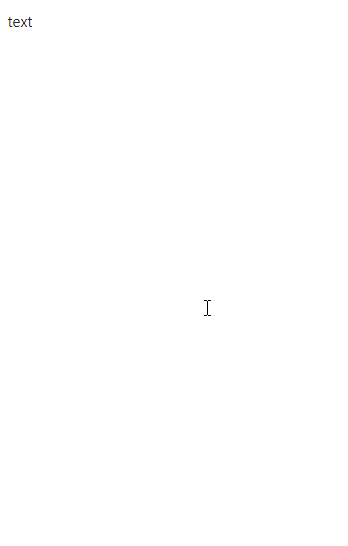
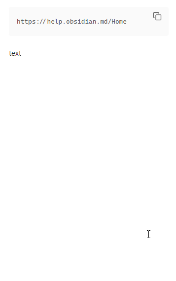

# Obsidian Links <!-- omit in toc -->

Manipulate links in [Obsidian](https://obsidian.md).

- [Features](#features)
  - [Create](#create)
    - [Create link from selection](#create-link-from-selection)
    - [Create link from clipboard](#create-link-from-clipboard)
  - [Convert](#convert)
    - [Convert to Wiki link](#convert-to-wiki-link)
    - [Convert to Markdown link](#convert-to-markdown-link)
      - [Single link](#single-link)
      - [Multiple links](#multiple-links)
    - [Convert to Autolink](#convert-to-autolink)
    - [Convert to HTML link](#convert-to-html-link)
  - [Unlink](#unlink)
  - [Remove links from headings](#remove-links-from-headings)
      - [Configuration](#configuration)
        - [Internal wikilink without text](#internal-wikilink-without-text)
  - [Delete link](#delete-link)
  - [Copy to clipboard](#copy-to-clipboard)
    - [Copy](#copy)
    - [Copy link destination to clipboard](#copy-link-destination-to-clipboard)
    - [Cut](#cut)
  - [Edit](#edit)
    - [Edit link text](#edit-link-text)
    - [Edit link destination](#edit-link-destination)
    - [Set link text](#set-link-text)
    - [Set link text from clipboard](#set-link-text-from-clipboard)
  - [Embed / Unembed files](#embed--unembed-files)

# Features

## Create
### Create link from selection
Create link from selected text.

- Command palette: **Create link**
- Context menu: **Create link**

To autoselect a word under the cursor enable 'Autoselect upon creating a link' in settings.

🎞️ Demo. Create a link from selection

🎞️ Demo. Create a link with the enabled option 'Autoselect upon creating a link'

### Create link from clipboard
Create link from textual content of the system clipboard.

- Command palette: **Create link from clipboard**
- Context menu: **Create link from clipboard**

To autoselect a word under the cursor enable 'Autoselect upon creating a link' in settings.

🎞️ Demo. Create a link from selection

🎞️ Demo. Create a link with the enabled option 'Autoselect upon creating a link'

## Convert

|                   |        **Wiki link**        |      **Makrdown link**      |        **HTML link**        |        **Autolink**         |
| ----------------- | :-------------------------: | :-------------------------: | :-------------------------: | :-------------------------: |
| **Wiki link**     |                             |  |  |                             |
| **Makrdown link** |  |                             |                             |  |
| **HTML link**     |                             |  |                             |                             |
| **Autolink**      |                             |  |                             |                             |
| **URL**           |                             |  |                             |  |

### Convert to Wiki link
Supported links:
- Markdown link

Execute via:
- Command palette: **Convert to wikilink**
- Context menu: **Convert to wikilink**

🎞️ Demo

### Convert to Markdown link

#### Single link
- Command palette: **Convert to markdown link**
- Context menu: **Convert to markdown link**

Supported links:
- Wikilink
- HTML link
- Autolink
- URL

Converts a wikilink or an HTML link to a markdown link. If a wikilink contains spaces a destination of a markdown link will be places in `<>`. HTML link must be expanded.

If a wikilink destination doesn't have an extension, the `.md` extension can be added to a markdown link destination after conversion (see **Convert to Markdown link | Append extension** option in Settings)

If an autolink or plain URL has an absolute URI with an `http` or `https` scheme, the content of the `<title/>` element will be used as the link text. If the request fails or the URL has a different scheme, the cursor will be placed inside the `[]` of the markdown link. For email autolinks, the `mailto` scheme will be added before the email address.

🎞️ Demo. Convert a wikilink to a markdown link

🎞️ Demo. Convert an HTML link to a markdown link

🎞️ Demo. Convert an autolink to a markdown link

🎞️ Demo. Convert a URL to a markdown link

#### Multiple links

Command palette: 
- **Convert all links to Markdown links**
- **Convert Wikilinks to Markdown links**
- **Convert URLs to Markdown links**
- **Convert Autolinks to Markdown links**
	
Context menu:
- **Convert all links to Markdown links** (enable in Settings)
- **Convert Wikilinks to Markdown links** (enable in Settings)
- **Convert URLs to Markdown links** (enable in Settings)
- **Convert Autolinks to Markdown links** (enable in Settings)
- **Convert HTML links to Markdown links** (enable in Settings)

Supported links:
- Wikilink
- URL
- Autolink
- HTML link

Converts multiple links in an active note or selection into markdown links.
Command in the Command palette and context menu is enabled if corresponding link type is present in the active note.
Context menu works only for selection.

For URLs and autolinks with absolute URLs using the `http://` or `https://` schemes, the link text will be set to the content of the `<title/>` element of the page loaded from the URL.

If a wikilink destination doesn't have an extension, the `.md` extension can be added to a markdown link destination after conversion (see **Convert to Markdown link | Append extension** option in Settings).

🎞️ Demo. Convert all links in an active note to markdown links 

🎞️ Demo. Convert all links in a selection to markdown links 

### Convert to Autolink

- Command palette: **Convert to autolink**
- Context menu: **Convert to autolink**

Supported links:
- Markdown
- URL

Converts a markdown link with an absolute URL or an email address into an autolink.

🎞️ Demo. Markdown link with absolute URL.

🎞️ Demo. Markdown link with email address.

🎞️ Demo. Convert an absolute URL to an autolink

### Convert to HTML link

- Command palette: **Convert to HTML link**
- Context menu: **Convert to HTML link**

Supported links:
	- Wikilink

Converts a wikilink to an HTML link.

🎞️ Demo. Create link to a note in a <a href="https://help.obsidian.md/Editing+and+formatting/Advanced+formatting+syntax#Diagram">diagram</a>

🎞️ Demo. Create link to a note's heading in a <a href="https://help.obsidian.md/Editing+and+formatting/Advanced+formatting+syntax#Diagram">diagram</a>

🎞️ Demo. Create link to a note in a class <a href="https://help.obsidian.md/Editing+and+formatting/Advanced+formatting+syntax#Diagram">diagram</a>

## Unlink

Unlink single link or all links in a selection.

- Command palette: **Unlink**
- Context menu: **Unlink**

🎞️ Demo. Single link.

🎞️ Demo. Links in a selection.

## Remove links from headings

Remove links from headings in selection or in an entire note. 
Each link is replaced with it's text. Links without text are removed. Wikilink without text by default replaced with it's destination.

- Command palette:  **Remove links from headings**

🎞️ Demo

#### Configuration

##### Internal wikilink without text

Available options:
- Remove
- Replace with destination   [default]
- Replace with lowest heading

🎞️ Demo. Remove

Original text:

After command execution:

🎞️ Demo. Replace with destination

Original text:

After command execution:

🎞️ Demo. Replace with lowest heading

Original text:

After command execution:

## Delete link

- Command palette: **Delete link**
- Context menu: **Delete**

Supported links:
- Wikilink
- Markdown link
- URL
- Autolink
- HTML link

If the target file for the deleted link is unreferenced the prompt to delete the file is displayed.
Configure this feature in the plugin settings:

🎞️ Demo. Wikilink

🎞️ Demo. Markdown link

🎞️ Demo. Autolink

## Copy to clipboard

### Copy

Copy markdown, wiki, auto, html link or plain url to the clipboard

- Command palette: Copy link
- Context menu: Copy link

🎞️ Demo. Copy link to the clipbard 

### Copy link destination to clipboard

- Command palette: **Copy link destination**
- Context menu: **Copy link destination**

Copy link destination of markdown, wiki or html link to the clipboard.

Demo

### Cut

Cut markdown, wiki, auto, html link or plain url to the clipboard

- Command palette: Cut link
- Context menu: Cut link

🎞️ Demo. Cut link to the clipbard 

## Edit
### Edit link text

Select link text and place cursor at the end of the text

- Command palette: **Edit link text**
- Context menu: **Edit link text**

Demo

### Edit link destination

Select link text and place cursor at the end of the text

- Command palette: **Edit link destination**
- Context menu: **Edit link destination**

Demo

### Set link text
Change or add link text, select it and place cursor at the end of the text. 
Link text depends on the kind of a link. 
For local notes text will be either file name of the note or popup with suggested link texts. Title separator can be specified in the plugin settings. 
For external http[s] links, page content is requested and link text is set to the title (content of `<title/>` element) of the requested page content.

- Command palette: **Set link text**
- Context menu: **Set link text**

🎞️ Demo. Link to a local note

🎞️ Demo. Link to a heading in a local note

🎞️ Demo. External link

### Set link text from clipboard

Set markdown, wikilink or URL text from clipboard.
Links that can't have text, like URL, will be converted to markdown link.

- Command palette: **Set link text from clipboard**
- Context menu: **Set link text from clipboard**

🎞️ Demo.

🎞️ Demo. Link to image

## Embed / Unembed files

Add or remove [file embedding](https://help.obsidian.md/Linking+notes+and+files/Embedding+files#:~:text=To%20embed%20a%20file%20in,of%20the%20Accepted%20file%20formats.) from a wikilink or a markdown link.

- Command palette: Embed/Unembed link
- Context menu: 
  - Embed
  - Unembed

🎞️ Demo. Embed 

🎞️ Demo. Unembed 

