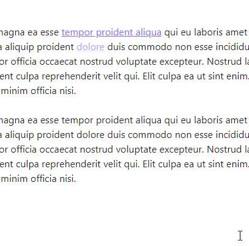

# Obsidian Links

Manipulate links in Obsidian (https://obsidian.md).

- [Obsidian Links](#obsidian-links)
- [Features](#features)
  - [Remove link](#remove-link)
  - [Convert link to markdown link](#convert-link-to-markdown-link)
  - [Convert markdown link to Wikilink](#convert-markdown-link-to-wikilink)
  - [Copy link to clipboard](#copy-link-to-clipboard)
  - [Remove links from headings](#remove-links-from-headings)
  - [Edit link text](#edit-link-text)
  - [Add link text](#add-link-text)

# Features

## Remove link

- Command palette: **Remove link**
- Context menu: **Remove link**

Demo

## Convert link to markdown link

Convert Wikilink or HTML link to markdown link. (With HTML link works only if link is expanded)

- Command palette: **Convert link to markdown link**
- Context menu: **Convert to markdown link**

Demo

## Convert markdown link to Wikilink
- Command palette: **Convert link to markdown link**
- Context menu: **Convert to markdown link**

Demo

## Copy link to clipboard

Copy link part of markdown, wiki or html link to clipboard.

- Command palette: **Copy link clipboard**

## Remove links from headings

Remove links from headings in selection or in an entier note.

- Command palette:  **Remove links from headings**

Demo

## Edit link text

Select link text and place cursor at the end of the text

- Command palette: **Edit link text**
- Context menu: **Edit link text**

Demo

## Add link text
add link text, select it and place cursor at the end of the text. For local path link text = file name of the note. For http[s] based URL link text = heading (`<head/>`) of the page.

- Command palette: **Add link text**
- Context menu: **Add link text**

Demo. Link to local note

Demo. Link to a heading in local note

Demo. External link

