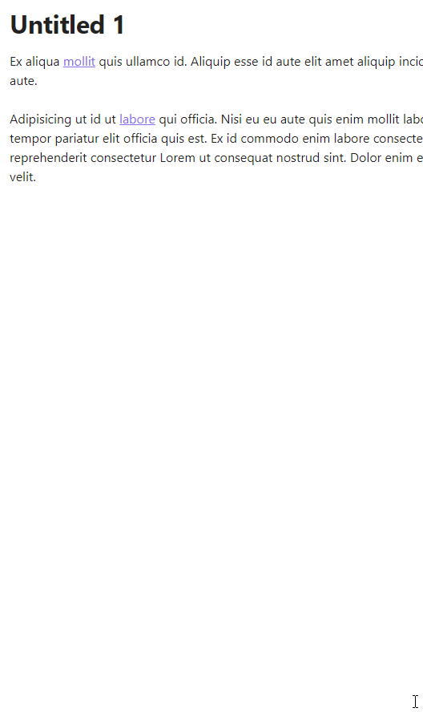
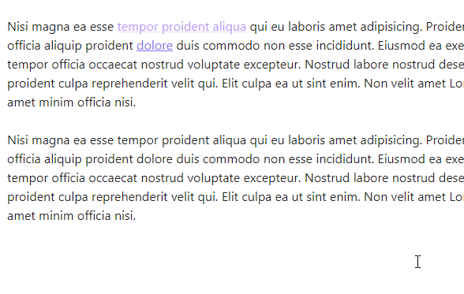
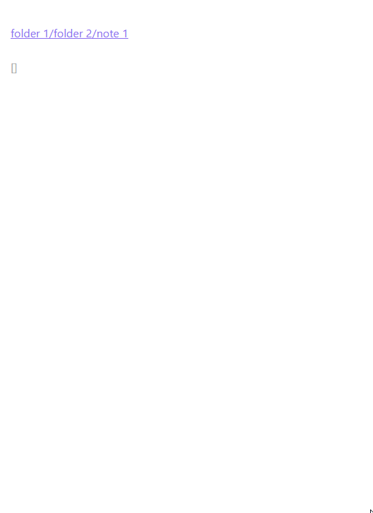
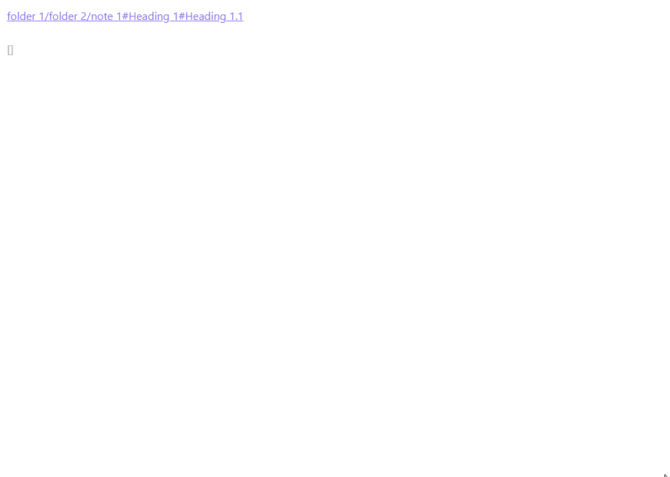

# Obsidian Links

Manipulate links in Obsidian (https://obsidian.md).

- [Obsidian Links](#obsidian-links)
- [Features](#features)
  - [Unlink](#unlink)
  - [Delete link](#delete-link)
  - [Convert wikilink or html link to markdown link](#convert-wikilink-or-html-link-to-markdown-link)
  - [Convert markdown link to Wikilink](#convert-markdown-link-to-wikilink)
  - [Copy link destination to clipboard](#copy-link-destination-to-clipboard)
  - [Remove links from headings](#remove-links-from-headings)
  - [Edit link text](#edit-link-text)
  - [Edit link destination](#edit-link-destination)
  - [Add link text](#add-link-text)
  - [Create link from selection](#create-link-from-selection)

# Features

## Unlink

- Command palette: **Unlink**
- Context menu: **Unlink**

Demo

## Delete link

- Command palette: **Delete link**
- Context menu: **Delete**

Demo

## Convert wikilink or html link to markdown link

Convert Wikilink or HTML link to markdown link. (With HTML link works only if link is expanded)

- Command palette: **Convert to markdown link**
- Context menu: **Convert to markdown link**

Demo

## Convert markdown link to Wikilink
- Command palette: **Convert link to wikilink**
- Context menu: **Convert to wikilink**

Demo

## Copy link destination to clipboard

Copy link part of markdown, wiki or html link to clipboard.

- Command palette: **Copy link destination**
- Context menu: **Copy link destination**

Demo

## Remove links from headings

Remove links from headings in selection or in an entier note.

- Command palette:  **Remove links from headings**

Demo

## Edit link text

Select link text and place cursor at the end of the text

- Command palette: **Edit link text**
- Context menu: **Edit link text**

Demo

## Edit link destination

Select link text and place cursor at the end of the text

- Command palette: **Edit link destination**
- Context menu: **Edit link destination**

Demo

## Add link text
Add link text, select it and place cursor at the end of the text. 
Link text depends on the kind of a link. 
For local notes text will be either file name of the note or popup with suggested link texts. Title separator can be specified in setting. 
For external http[s] links, page content is requested and link text is set to the title (content of `<title/>` element) of the page.

- Command palette: **Add link text**
- Context menu: **Add link text**

Demo. Link to local note

Demo. Link to a heading in local note

Demo. External link

## Create link from selection
Create link from selected text.

- Command palette: **Create link**
- Context menu: **Create link**

Demo

