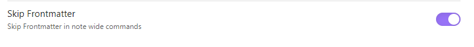

# Convert wiki or markdown link to HTML link

> [!NOTE] 
> Insider feature. Enable in settings.

Skip links in a Frontmatter for note wide commands:
- Convert Wikilinks to Markdown links
- ...

> [!NOTE]
> Links in the frontmatter won't be ignored if they are part of the selected text.